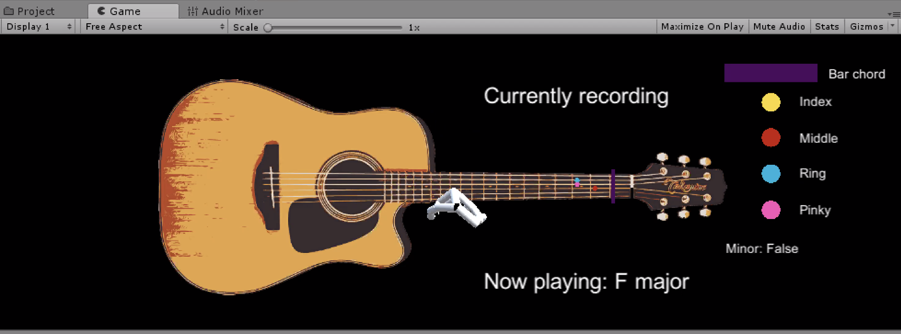

# AirGuitar
For our 6.835 final project, we built a multimodal virtual guitar player called AirGuitar. This program was built in Unity and interfaced with a LeapMotion, a laptop keyboard, and a laptop microphone to allow a user to input chords and strumming patterns to the program. AirGuitar is able to detect these chords and strumming patterns, visualize them on screen for the user, and play the corresponding music back to them real-time. The program also allows a user to record their music and play it back as well, with the voice commands "Start", "Stop", and "Playback". 

## Installation
AirGuitar requires Unity 2018 1.1 and the LeapMotion Orion 4.0.0 for your SDK. You will need to have a LeapMotion readily available, as well as a working microphone on your laptop that accepts inputs.

To run this project:
  1. Clone this repository
  2. From the Unity Hub, open the root folder up in Unity 2018 1.1. This will open the project in Unity.
  3. Plug in your LeapMotion
  4. Press the play button at the top of the Unity editor to start the program. It should open to the intro screen. Click 'Play'. 
  5. Make sure your LeapMotion is working by waving your hand above it and seeing if the hand appears on the screen. 
  6. For chords to be recognized, your index finger and thumb must be pressing as if you are holding a pick. Try strumming, and you should hear the sound of the open strings on a guitar.
  7. Play a song! Remember that you can use voice commands 'Start' to start a recording, 'Stop' to stop it, and 'Playback' to listen to it.

## Demos
First prototype: https://www.youtube.com/watch?v=xeBiznrQeRw&feature=youtu.be

Second prototype: https://youtu.be/PMuuiR4kzuY

Third prototype: https://youtu.be/mP9nLpaoNk4

Final build: https://www.youtube.com/watch?v=ctez3kwp0w4

